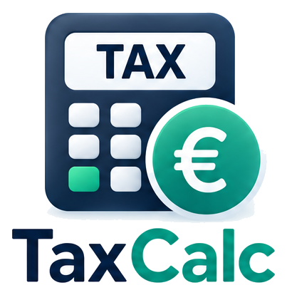

<p align="center"></p>
<h1 align="center">TaxCalc</h1>
<p align="center"><strong>Know what actually lands in your bank.</strong></p>

TaxCalc is a private, transparent salary calculator for Ireland, the United Kingdom, and India. It supports both gross-to-net and net-to-gross calculations, explains the deductions applied, and exposes the tax year and official sources behind every enabled country engine.

## Supported calculations

| Country | Tax year | Included controls |
| --- | --- | --- |
| Ireland | Current enabled engine | Gross/net direction, personal status, pension contribution, income tax, USC, and PRSI |
| United Kingdom | Current enabled engine | England/Wales/Northern Ireland and Scotland, salary sacrifice pension, National Insurance, and student/postgraduate loan plans |
| India | FY 2026–27 engine | New or Old Regime, estimated income tax, standard deductions represented by the engine, and actual PF/retirement contribution |

The active tax year, engine version, verification date, and primary government references are shown in the application’s Tax Rules & Sources page.

## Product features

- Convert an annual, monthly, or weekly gross salary into estimated take-home pay.
- Work backwards from a desired net salary to the gross salary that may be required.
- Switch countries without mixing rules, currencies, or formatting conventions.
- See gross pay flow through tax, social contributions, pension, other deductions, and net pay.
- Inspect a detailed deduction breakdown and effective or marginal-rate context.
- Compare a potential raise with the current scenario.
- Review assumptions that commonly make a real payslip differ from a simple estimate.
- Export the current result as JSON, with the country, tax year, engine version, and disclaimer attached.
- Use the calculator on desktop or mobile without creating an account.

## Calculation architecture

Country engines implement one shared interface in `lib/tax`. Money is represented in minor units during core calculations to reduce floating-point rounding errors. Each engine owns its bands, allowances, credits, social contributions, special regional logic, and source registry. Net-to-gross mode repeatedly calls the same gross-to-net engine so both directions share one rule implementation.

Tax rules are not scraped into production automatically. A future year is enabled only after its official rules have been reviewed, implemented, and covered by deterministic tests.

## Privacy and limitations

Calculations run in the browser. TaxCalc has no account system, payroll connection, employer integration, salary database, or server-side calculation endpoint.

Results are estimates, not official payslips, tax assessments, payroll advice, or financial advice. Actual figures may differ because of tax codes or certificates, cumulative/emergency taxation, prior earnings, benefits in kind, bonuses, payroll dates, pension arrangements, local professional taxes, employer-specific deductions, and rounding.

## Technology

- React, TypeScript, and the vinext/Vite application toolchain
- Country-specific deterministic tax engines
- Base UI and shadcn components for accessible controls
- Recharts for visual breakdowns
- Static hosting with no database requirement

## Local development

```bash
npm install
npm run dev
```

Run the tax-engine checks and production build with:

```bash
npm run test:tax
npm run lint
npm run build
```

## Project structure

```text
app/                     Routes, metadata, and information pages
components/              Calculator, visualisation, and UI components
lib/tax/engines/         Ireland, UK, and India rule implementations
lib/tax/types.ts         Shared engine contract and result model
tests/                   Deterministic tax-engine coverage
public/brand/            Cropped transparent logo and wordmark assets
```

## Updating a tax year

Create or revise the relevant country engine, record its official primary sources, update its version and verification date, and add boundary tests for allowances, bands, tapers, social contributions, and rounding. Do not relabel an older engine as current without completing those checks.
